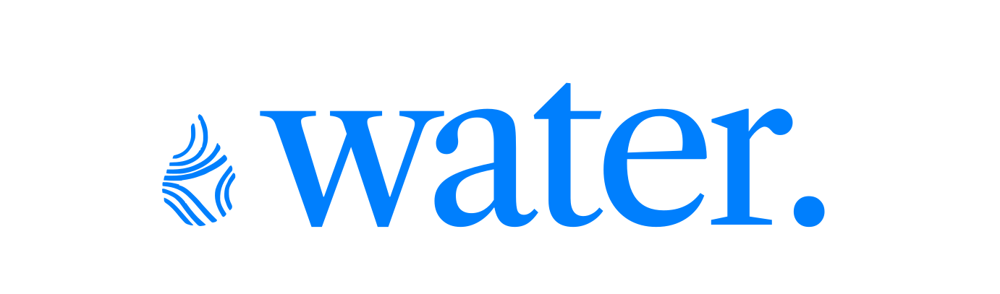
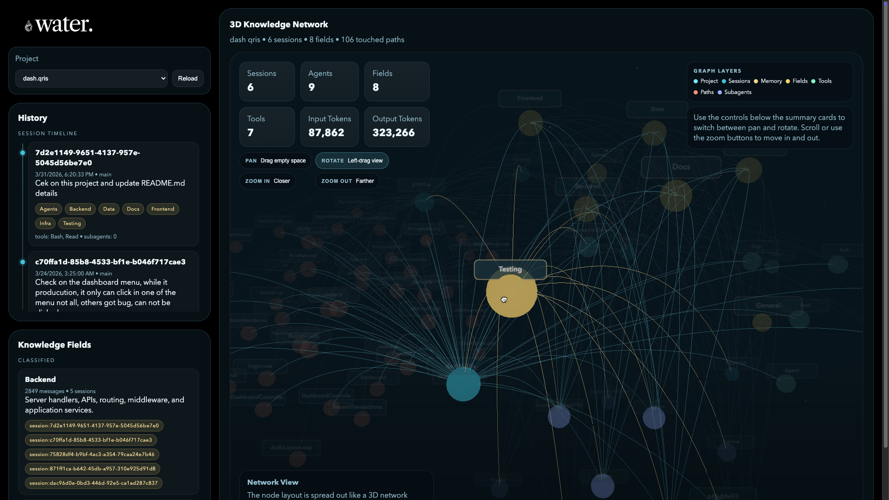

<div align="center">
  

  **Visual brain of MCP agents** — understand knowledge retention, reasoning paths, and token flow.

  [](./LICENSE)
  [](https://go.dev)
  []()
  [](https://github.com/altamisatmaja/water/stargazers)

  [Quick Start](#quick-start) · [Features](#features) · [Architecture](#architecture) · [CLI Reference](#cli-reference) · [Contributing](#contributing)
</div>

---


## What is Water?



Water is a **lightweight, self-hosted visualization tool** for Claude Code agents and MCP-based systems. It captures everything your agent does and turns it into an interactive knowledge graph you can explore in your browser.

No cloud. No account. No telemetry. Everything stays on your machine.

```
Claude Code Agent  →  Water Hook  →  DuckDB (.water/)  →  Dashboard (localhost:3141)
```

## Quick Start

### Install

**Clone the repository**
```bash
git clone https://github.com/altamisatmaja/water
cd water
```

**Install the `water` command from this clone**

After `cd water`, run:

**macOS / Linux**
```bash
go run ./cmd/water install
```

**Windows (PowerShell)**
```powershell
go run ./cmd/water install
```

What `water install` does:
- builds `bin/water` (or `bin/water.exe` on Windows)
- creates a user-level symlink/shim so you can run `water`, `water --help`, and `water serve`
- tells you how to add the command directory to PATH if needed
- on macOS, it prints the `~/.zshrc` `export PATH=...` command when required

Open a new terminal after install, then verify:

```bash
water --help
```

If you move the cloned repository later, run `go run ./cmd/water install` again from the new location so the user-level symlink/shim points to the correct binary.

Example install output:

```text
✓ Water install complete

Repository:
  /path/to/water

Built binary:
  /path/to/water/bin/water

Command shim:
  /Users/you/.local/bin/water

PATH:
  Add this directory to PATH:
    /Users/you/.local/bin

  Run this command in your terminal:
    echo 'export PATH="/Users/you/.local/bin:$PATH"' >> ~/.zshrc

  Then open a new terminal and run:
    water --help

Next:
  water --help
  water serve
```

### Run

```bash
# 1. Initialize in your project
cd your-claude-code-project
water init

# 2. Start the dashboard
water serve
# → Opens http://localhost:3141 automatically
```

That's it. Water creates a `.water/` folder, starts a local HTTP server, and opens the dashboard. As your agent runs, the knowledge graph updates in real time.

---

## Features

### 🧠 Knowledge Graphs
See every piece of information your agent learned — as an interactive node graph.

- Nodes = knowledge chunks captured from MCP tool outputs
- Edges = semantic, causal, or retrieval relationships between nodes
- Node size scales with access frequency — busy nodes appear larger
- Edge opacity decays over time (`salience = exp(-Δt/τ)`) — you can literally watch the agent forget

### 📊 Token Economics
Understand the real cost and efficiency of every knowledge chunk:
- Token usage per node (input + output)
- Memory retention rate — what percentage of nodes are still "active"?
- Daily aggregates: token cost trends, retention curves, community growth

### 🔍 Reasoning Paths
Trace the agent's decision-making from query to answer:
- Step-by-step trace of tool calls and decisions
- Confidence scores at each decision point
- Alternative paths not taken (counterfactuals)
- Click any trace step to highlight the relevant graph region

### 🏘️ Community Detection
Nodes cluster automatically using the Louvain algorithm — similar knowledge groups together by color. Useful for spotting knowledge gaps and redundant information.

### 📡 Live Updates
The dashboard updates in real time via WebSocket as your agent runs. No refresh needed.

---

**Tech stack:**
- **Backend**: Go 1.22, Cobra CLI, DuckDB (embedded), standard `net/http`
- **Frontend**: embedded dashboard + Three.js 3D knowledge graph
- **Embeddings**: `all-minilm-l6-v2` via ONNX Runtime (local, no API key needed)
- **Distribution**: Single static binary — frontend embedded via `//go:embed`

---

## CLI Reference

```bash
water install           # Build from this clone and install a user-level command shim
water init              # Initialize .water/ in current project
water serve             # Start dashboard at http://localhost:3141
water watch             # Live event tail in terminal
water history           # Show Claude session history
water memo              # Show Claude memory files
water brain             # Print a local Claude project summary
```

**Common flags:**

| Flag | Default | Description |
|------|---------|-------------|
| `--open-browser` | `true` | Auto-open dashboard on `serve` |

---

## Data Privacy

Water is **fully local-first**:

- ✅ All data stays on your machine
- ✅ No cloud sync by default
- ✅ No telemetry or analytics
- ✅ No account required
- ✅ Open source (MIT)

Share snapshots manually with teammates using `water export --anonymize`.

---

## Project Structure

```
water/
├── cmd/water/          # CLI entry points (Cobra commands)
├── internal/
│   ├── capture/        # Event schema & JSONL streaming
│   ├── graph/          # DuckDB client, nodes, edges, traces
│   ├── server/         # HTTP handlers, WebSocket
│   ├── metrics/        # KNN, Louvain, salience decay
│   ├── config/         # Viper config management
│   └── logger/         # Structured logging (slog)
├── pkg/
│   └── embedding/      # Local ONNX + Anthropic API embeddings
├── web/                # Svelte frontend (embedded into binary)
│   └── src/
│       ├── components/ # Graph, Timeline, Metrics, Sidebar
│       ├── stores/     # Svelte state management
│       └── types/      # TypeScript interfaces
├── agents/             # Claude Code agent definitions
├── skills/             # Reusable coding patterns for agents
├── test/               # Integration tests & fixtures
├── CLAUDE.md           # Agent instructions & project conventions
└── Makefile
```

---

## Requirements

| | Minimum |
|---|---|
| OS | macOS 10.15+, Linux (any), Windows 10+ |
| RAM | 2 GB |
| Disk | 500 MB (for binary + database) |
| Go | 1.23+ *(required for `go run ./cmd/water install`)* |

No Node.js required to run Water — the frontend is pre-built and embedded in the binary.

---

## Contributing

Water is in **Alpha** and actively being built. All contributions are welcome.

### Getting started

```bash
# Fork & clone
git clone https://github.com/YOUR_USERNAME/water.git
cd water

# Install dependencies
make setup

# Run tests
make test

# Build
make build

# Try it
./bin/water init
./bin/water serve
```

---

## Community

| Channel | Link |
|---------|------|
| 🐛 Bug reports | [GitHub Issues](https://github.com/water-viz/water/issues) |
| 💡 Feature requests | [GitHub Discussions](https://github.com/water-viz/water/discussions) |
| 📖 Documentation | [ARCHITECTURE.md](./ARCHITECTURE.md) · [API.md](./API.md) |
| 💬 Real-time chat | Discord *(coming soon)* |

---

## Acknowledgments

Water was inspired by:
- [LangSmith](https://smith.langchain.com) — LLM observability done right
- [Cursor Composer](https://cursor.sh) — IDE + agent tightly integrated
- The [MCP ecosystem](https://modelcontextprotocol.io) — for making agents composable

---

## License

MIT — see [LICENSE](./LICENSE)

---

<div align="center">
  
  <br/>
  <sub>Built for developers who want to understand what their agents are thinking.</sub>
  <br/><br/>
  <strong>Give it a ⭐ if Water helps you debug your agents!</strong>
</div>
